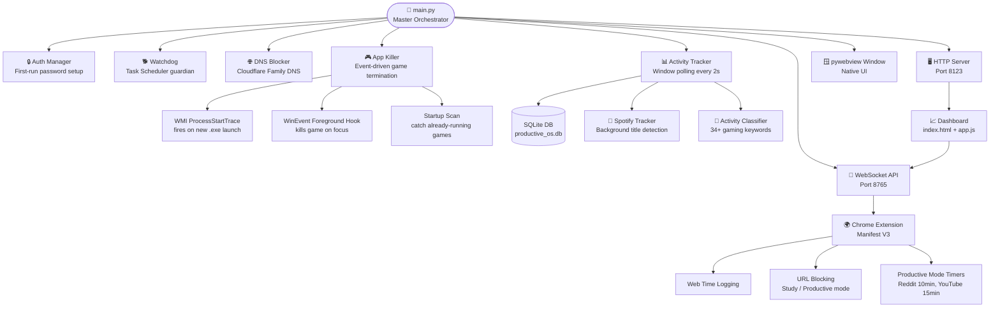
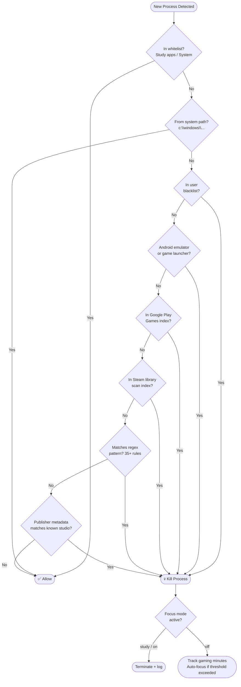
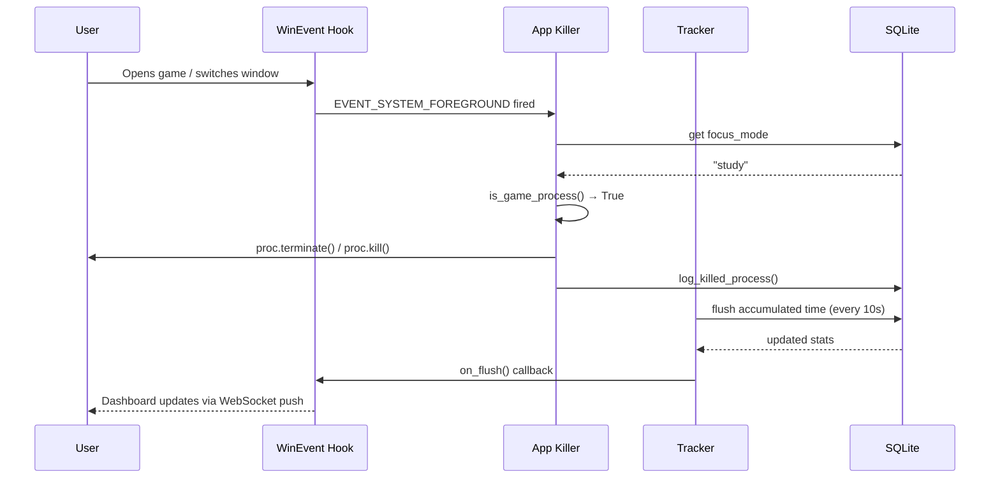
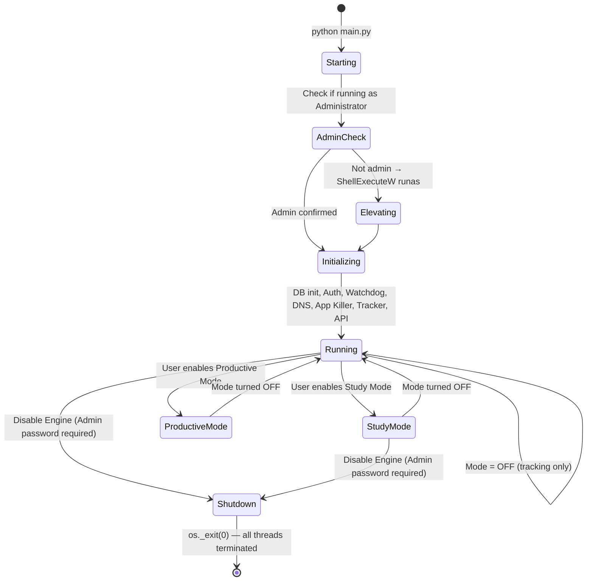

<div align="center">


<br/><br/>

# 🧠 Productive-OS v3.7 (beta)
### *Your AI-Powered Study Partner — Not Just Another Website Blocker*

> **The only Windows productivity tool that locks down your entire system at the OS level, rewards your focus with real tokens, detects games dynamically, and fights back when you try to cheat.**

<br/>

[📥 Installation](#-installation--setup) · [🗺️ Architecture](#-system-architecture) · [✨ Features](#-feature-breakdown) · [🔧 Troubleshooting](#%EF%B8%8F-troubleshooting--faq) · [🗺️ Roadmap](#%EF%B8%8F-roadmap) · [🧹 Uninstall](#-complete-uninstallation--wipe)

</div>

---

## 📋 Table of Contents

1. [Why Productive-OS Is Different](#-why-productive-os-is-different)
2. [What's New in v3.7 (beta)](#-whats-new-in-v37-beta)
3. [Feature Breakdown](#-feature-breakdown)
4. [System Architecture](#-system-architecture)
5. [Tech Stack](#-tech-stack)
6. [Installation & Setup](#-installation--setup)
7. [Complete Uninstallation & Wipe](#-complete-uninstallation--wipe)
8. [Project File Structure](#-project-file-structure)
9. [Engine Lifecycle](#-engine-lifecycle)
10. [Dashboard Preview](#%EF%B8%8F-dashboard-preview)
11. [Troubleshooting & FAQ](#%EF%B8%8F-troubleshooting--faq)
12. [Roadmap](#%EF%B8%8F-roadmap)
13. [Disclaimer](#%EF%B8%8F-disclaimer)

---

## 🤔 Why Productive-OS Is Different

Most focus apps are trivially easy to bypass. Close the extension. Switch to a different browser. Uninstall the app. Done — distraction wins.

**Productive-OS does not let that happen.**

Instead of playing nice, it digs deep into your Windows system. It:
- 👁️ Watches every active window via **Win32 API hooks**
- 🌐 Intercepts DNS requests **before they reach your browser**
- 🎮 Dynamically scans for games using **WMI process-start events** and kills them instantly
- 🎵 Tracks what you're listening to on Spotify, even in the background
- 🔒 Locks itself behind an admin password with a **self-healing watchdog** process

When you actually study? It **rewards** you — with a token economy that unlocks real game time. Focus stops being a punishment. It becomes a game you can win.

---

## 🆕 What's New in v3.7 (beta)

### 🚀 Headless Engine & Decoupled Native UI
The core application has been re-architected for a seamless, premium user experience:
- **Zero UAC Prompts for UI**: The front-end UI (`pywebview`) is decoupled from the background process, allowing it to open instantly in user-space without UAC prompts.
- **Single-Instance Mutex & Focus Behavior**: Spawning a second window automatically focuses the existing window instead of creating duplicate processes (matching Spotify-style native behaviour).
- **Background Startup via Task Scheduler**: Administrative rights are requested once during installation to register a Scheduled Task. The engine starts silently on logon at `/rl HIGHEST`, bypassing UAC.

### ⚡ PyInstaller Folder-Based Distribution
We migrated the build process from a slow `--onefile` package (which took 5–10 seconds to extract at launch) to a folder-based distribution. Startup is now **instant**.

### 🔄 True Silent Auto-Updates
The background engine now automatically checks for updates from GitHub Releases:
- It downloads the latest binaries silently, shuts down the active instance, overwrites the PyInstaller folder in place, and re-executes the Scheduled Task, ensuring zero downtime and zero data loss.

### 🧹 Official Uninstall & Clean Wipe Scripts
We added dedicated `uninstall.bat` and `uninstall.ps1` scripts to fully purge the app, removing all scheduled tasks, registry policies, DNS configurations, database tables, and temporary debug logs (preserving compiled installer binaries).

---

## 🆕 What's New in v3.6

### Game Detection Engine — Complete Rewrite (Event-Driven)
The old polling-based game detection has been replaced with a zero-overhead, event-driven architecture:

- **WMI `Win32_ProcessStartTrace`** — the OS itself notifies the engine the instant any `.exe` launches. No more polling every 5 seconds; reaction time is now **< 100 ms**.
- **`SetWinEventHook EVENT_SYSTEM_FOREGROUND`** — a second hook kills a game window the instant it becomes the foreground window, before the user can interact.
- **No CPU/GPU heuristics** — safe for heavy creative software like DaVinci Resolve, Blender, and After Effects. Game detection is based purely on process identity.

### Google Play Games for PC — Now Fully Blocked
Scans `%LOCALAPPDATA%\Google\Play Games\` at startup, indexes every game executable, and terminates all matching processes in Study Mode. Games launched via the Google Play Games launcher (including Free Fire MAX) are now caught.

### Android Emulators — Detected & Blocked
BlueStacks, LDPlayer, NoxPlayer, MuMu Player, MEmu, and GameLoop are explicitly catalogued as gaming launchers and terminated immediately in Study Mode.

### Critical Bug Fix — Study Mode Never Killed Games
A logic error (`focus_mode == "on"` instead of `focus_mode in ("study", "on")`) meant the game killer was silently a no-op in Study Mode. **Fixed.**

### Single-Instance Mutex
A system-wide Windows mutex (`CreateMutexW`) prevents duplicate engine instances from running concurrently, eliminating double-counted screen time.

### UI & Branding Fixes
- Fixed stale `localhost:8080` references in `ui.py` and `tracker.py` → now correctly `8123`
- Added Atharvotech™ developer disclaimer to the Settings page
- Expanded `GAMING_KEYWORDS` in `tracker.py` from 9 entries to 34+ for accurate category classification

---

## ✨ Feature Breakdown

### 🔒 System-Level Lockdown
Operates at the OS level — modifying DNS settings, writing to the Windows Registry, and using process-level controls. Works across **all browsers, all apps, and all windows** simultaneously.

### 🎮 Dynamic Game Detection & Killing
| Detection Method | Description |
|-----------------|-------------|
| WMI Process Start Trace | Fires on every new `.exe` launch — near-zero idle CPU |
| WinEvent Foreground Hook | Kills game window the instant it gains focus |
| Steam Library Scanner | Indexes all `.exe` files in `steamapps/common` |
| Google Play Games Scanner | Indexes `%LOCALAPPDATA%\Google\Play Games\` |
| Regex Pattern Matching | 35+ patterns covering major titles |
| Exe Publisher Metadata | Reads `CompanyName` from PE version resource |
| Emulator Detection | BlueStacks, LDPlayer, NoxPlayer, MuMu, MEmu, GameLoop |
| User Blacklist | Custom executables added via the dashboard |

### 🌐 Family-Safe DNS Filtering
Automatically configures system DNS to block adult content and harmful sites the moment a focus session starts. Uses enterprise-grade approach (Cloudflare Family DNS 1.1.1.3).

### 📊 Real-Time Analytics Dashboard
A live dashboard built with Chart.js, featuring:
- Hourly heatmap of screen time
- Category breakdown (Study / Gaming / Social / Entertainment)
- Top applications bar chart
- Spotify listening timeline
- Web activity table (today's data only, strictly date-filtered)
- Token balance and transaction history

### 🏆 Token Economy
Every focused minute earns tokens stored in a tamper-protected SQLite database.

| Action | Tokens |
|--------|--------|
| 1 hour of study time | +30 tokens |
| 1 hour of gaming | −15 tokens |
| Unlock 30 min game time | −15 tokens |
| Bypass attempt detected | −50 tokens |

### 🔐 Admin Password & Self-Healing Watchdog
A master password set during first-run setup. A background watchdog task (Windows Task Scheduler) automatically restarts the engine if it is force-killed. Security question recovery is built in.

### 🎵 Spotify Background Tracking
Tracks listening time even when Spotify is minimized or not the focused window, using `EnumWindows` to find Spotify's window title in the background.

### 🏫 Study Mode — Full Enforcement
- Force-maximizes all windows (minimizing is blocked via WinEvent hooks)
- Disables Windows Snap Assist via Registry
- Locks `chrome://extensions` and `edge://extensions` via Group Policy registry keys (prevents disabling the monitoring extension)
- DNS-blocks distracting sites
- Terminates all detected games instantly

---

## 🗺️ System Architecture

### High-Level Component Flow



### Game Detection Decision Tree



### Study Mode Enforcement Chain



---

## 💻 Tech Stack

| Layer | Technology |
|-------|------------|
| **Backend Core** | Python 3.8+ — `psutil`, `winreg`, `ctypes`, `threading`, `wmi` |
| **Process Events** | WMI `Win32_ProcessStartTrace` + `SetWinEventHook` |
| **Data & Auth** | SQLite3, `bcrypt` |
| **Real-Time API** | `websockets` (Port 8765) + stdlib HTTP Server (Port 8123) |
| **Frontend Dashboard** | HTML5, Vanilla CSS (Glassmorphism), Vanilla JS, Chart.js 4.x |
| **Native Window** | `pywebview` (wraps dashboard in a native OS window, runs non-elevated) |
| **Browser Integration** | Chrome Extension — Manifest V3 + Packed force-install policy (`ExtensionInstallForcelist`) |
| **Persistence** | Windows Task Scheduler (`schtasks`) at `/rl HIGHEST` for silent boot without UAC prompts |
| **Build** | PyInstaller + Inno Setup (`build.py` & `installer.py`) — Folder-based setup packages (`.exe`) |
| **Clean Uninstall** | `uninstall.bat` (CMD) & `uninstall.ps1` (PowerShell) for a complete system wipe |

---

## 🚀 Installation & Setup

> ⏱️ **Total setup time: ~3 minutes**

### Step 1 — Clone & Install Dependencies

```bash
git clone https://github.com/atharvotech/Productive-OS.git
cd Productive-OS
pip install -r requirements.txt
```

> `requirements.txt` installs: `psutil`, `websockets`, `bcrypt`, `pywin32`, `pywebview`, `pyinstaller`, `wmi`

### Step 2 — Install the Chrome Extension

1. Open Chrome or Brave → navigate to `chrome://extensions/`
2. Enable **Developer Mode** (toggle, top-right)
3. Click **Load unpacked** → select the `extension/` folder
*(Note: Production builds force-install this automatically using group policy registry overrides).*

### Step 3 — Run the Local Dev Build or Compile Installer

- **To run in development mode (from source)**:
  Launch terminal as Administrator and run:
  ```bash
  python main.py
  ```
- **To compile a local installer**:
  Make sure you have [Inno Setup](https://jrsoftware.org/isdownload.php) installed on your system. Then run:
  ```bash
  # Compile local dev build installer
  python scripts/build.py
  
  # Or compile production installer (pulls latest release from GitHub)
  python scripts/installer.py
  ```
  This creates `Productive-OS-Dev-Setup.exe` or `Productive-OS-Setup.exe` in the `installer/` directory. Run the executable as Administrator once. It will install the application and configure the scheduled start task.

---

## 🧹 Complete Uninstallation & Wipe

If you need to uninstall the app completely, revert registry group policies, reset DNS overrides, and clear SQLite telemetry databases:

### Option A (Recommended)
1. Navigate to the project root directory.
2. Right-click [scripts/uninstall.bat](file:///c:/Users/athar/OneDrive/Desktop/Productive-OS/scripts/uninstall.bat) and choose **"Run as administrator"**.
3. Press any key once the wipe finishes.

### Option B (PowerShell)
1. Open an Administrator PowerShell console.
2. Run the cleanup script:
   ```powershell
   Set-ExecutionPolicy Bypass -Scope Process -Force
   .\scripts\uninstall.ps1
   ```

---

## 📁 Project File Structure

```
Productive-OS/
│
├── core/                        # Python Backend Engine
│   ├── api_server.py            # WebSocket (8765) + HTTP (8123) server
│   ├── app_killer.py            # Event-driven game detection & termination
│   ├── auth.py                  # Admin password + bcrypt + recovery Q&A
│   ├── database.py              # SQLite database layer (core/data.db)
│   ├── dns_blocker.py           # Cloudflare Family DNS via netsh + incognito block
│   ├── tracker.py               # Window activity poller + Registry blocklist
│   └── watchdog.py              # Task Scheduler self-healing guardian
│
├── dashboard/                   # Web UI (served at localhost:8123)
│   ├── index.html               # Single-page app shell
│   ├── style.css                # Dark glassmorphism design system
│   └── app.js                   # WebSocket client + Chart.js rendering
│
├── extension/                   # Chrome Extension (Manifest V3)
│   ├── manifest.json
│   ├── background.js            # Service worker: tracking + URL blocking
│   └── content.js               # Media-playing state detection
│
├── main.py                      # Master Orchestrator — entry point
├── ui.py                        # pywebview native window launcher
├── docs/                        # Documentation and resources
│   ├── AGENT_INSTRUCTIONS.md    # Agent memory and instructions
│   ├── EULA.txt                 # End User License Agreement
│   └── how.txt                  # General notes
├── scripts/                     # Utility and installation scripts
│   ├── build.py                 # Local dev builder (packages folders)
│   ├── installer.py             # Production GitHub pull builder
│   ├── kill_engine.py           # Utility to forcefully stop the engine
│   ├── graphify_step1.ps1       # Script to setup graphify
│   ├── uninstall.bat            # One-click admin uninstall batch utility
│   └── uninstall.ps1            # Admin uninstall PowerShell utility
└── requirements.txt
```

---

## ⚙️ Engine Lifecycle



---

## 🖥️ Dashboard Preview

The dashboard features:
- **Overview** — live activity feed, stat cards (study time, screen time, tokens, streak), daily activity chart, category donut
- **Screen Time** — top applications bar chart, hourly heatmap, detailed usage table
- **Web Activity** — per-domain time chart, web category breakdown, recent URLs (today only)
- **Spotify** — now-playing equalizer animation, listening time, recent tracks
- **Tokens** — balance, history chart, transaction log
- **Settings** — mode toggle, DNS blocking, blocked/whitelisted apps, YouTube channel whitelist, token rates, password management, engine disable

All rendered in a **dark glassmorphism** UI with micro-animations, smooth gradients, and real-time WebSocket updates.

---

## 🛠️ Troubleshooting & FAQ

<details>
<summary><strong>❓ I forgot my Admin Password</strong></summary>

On the dashboard → Settings → Security & Engine Control → click **"Forgot Password?"**. Answer the security question you set during first-run to reset your password.

</details>

<details>
<summary><strong>❓ Incognito Mode is not being blocked</strong></summary>

Ensure `main.py` was launched with **Administrator privileges**. The engine writes to `HKLM` Registry hive which requires elevation. Run in an admin terminal.

</details>

<details>
<summary><strong>❓ The dashboard is not loading at localhost:8123</strong></summary>

Check that ports `8123` (HTTP) and `8765` (WebSocket) are free:

```powershell
netstat -ano | findstr :8123
netstat -ano | findstr :8765
```

Kill any conflicting process, then restart `main.py`.

</details>

<details>
<summary><strong>❓ A game is not being detected or killed</strong></summary>

**Option A:** Add the `.exe` name manually in Dashboard → Settings → Blocked Applications.

**Option B:** Open a GitHub issue with the executable name. The `GAME_EXE_PATTERNS` list is updated regularly.

**Common cause:** The game's `.exe` name doesn't match any known pattern AND it's not in your Steam / Google Play Games library scan. The explicit blacklist in settings always works as a guaranteed override.

</details>

<details>
<summary><strong>❓ DaVinci Resolve / Blender is being killed</strong></summary>

These are explicitly in the `STUDY_APPS` whitelist in `app_killer.py` and will never be killed. If you are experiencing this, please open an issue — it is a bug.

</details>

<details>
<summary><strong>❓ Screen time is showing more than actual usage</strong></summary>

Most likely caused by a ghost process from a previous session that wasn't fully terminated. The v3.6 singleton mutex prevents this — only one engine instance can run at a time. If you see stale data, it is from an earlier session recorded in SQLite for today's date.

</details>

<details>
<summary><strong>❓ WMI process watcher not starting</strong></summary>

Install the `wmi` package:

```bash
pip install wmi
```

The engine gracefully falls back to a lightweight 3-second polling loop (tracking only new PIDs, not rescanning all processes) if WMI is unavailable.

</details>

---

## 🗺️ Roadmap

### ✅ Completed
- [x] Win32 window activity tracking + idle detection
- [x] SQLite telemetry database + token economy
- [x] Chrome Extension (Manifest V3) with real-time tab tracking
- [x] Admin password, bcrypt hashing, security question recovery
- [x] Family-safe DNS auto-configuration (Cloudflare 1.1.1.3)
- [x] Self-healing Watchdog via Windows Task Scheduler
- [x] PyInstaller single-exe build pipeline
- [x] Glassmorphism real-time analytics dashboard (Chart.js)
- [x] Spotify background listening tracker
- [x] Study Mode: window maximization enforcement + Snap Assist lock
- [x] Extension page lockdown (`chrome://extensions` via Group Policy registry)
- [x] **v3.5**: Background headless engine, 10s flush, Spotify fix, web date filter
- [x] **v3.6**: Event-driven WMI game detection, Google Play Games, emulator blocking, critical bug fixes, singleton mutex
- [x] **v3.7 (beta)**: Decoupled UI launcher, Scheduled Task startup, folder distribution, auto-update mechanism, dedicated uninstaller scripts

### 🔜 Upcoming
- [ ] **Pomodoro Mode** — enforced 25/5 break timers with mandatory lock screen
- [ ] **Mobile Companion App** — view live stats from your phone
- [ ] **Weekly Focus Reports** — PDF summary emailed to you
- [ ] **AI Study Insights** — pattern analysis to suggest optimal focus windows
- [ ] **Cloud Sync** — backup telemetry and settings across devices

---

## 🤝 Contributing

Contributions are welcome — bug fixes, new game patterns, dashboard improvements, or documentation. To contribute:

```bash
git fork https://github.com/atharvotech/Productive-OS
git checkout -b feature/your-feature-name
# make your changes
git commit -m "feat: describe your change"
git push origin feature/your-feature-name
# open a Pull Request
```

> ⚠️ This is currently a **personal project**. External redistribution or commercial use without explicit written permission from Atharvotech™ is not permitted.

---

## ⚠️ Disclaimer

Productive-OS makes real, active changes to your Windows OS — including modifying `HKLM` Registry keys, changing system DNS via `netsh`, forcefully terminating processes, and installing Windows Task Scheduler tasks. **Use at your own risk.**

The developers are not responsible for system lockouts or data loss caused by manually tampering with the locked SQLite database while the engine is running. Always use the official admin password flow to stop or modify an active session.

---

<div align="center">

<h2>Made with ❤️ in INDIA By <i>ATHARVOTECH™ — THE WORLD OF INFINITE CREATIVITY</i></h2>

© 2026 Atharvotech™ (Atharv Shukla). All Rights Reserved.  
This is a personal project and is currently closed for external distribution or modification.

<br/>


</div>
